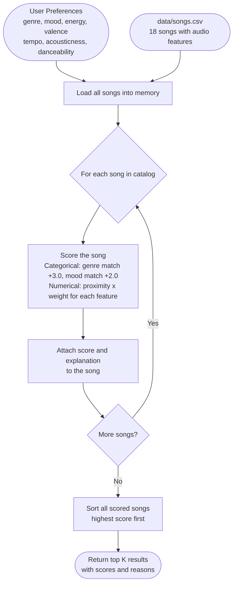
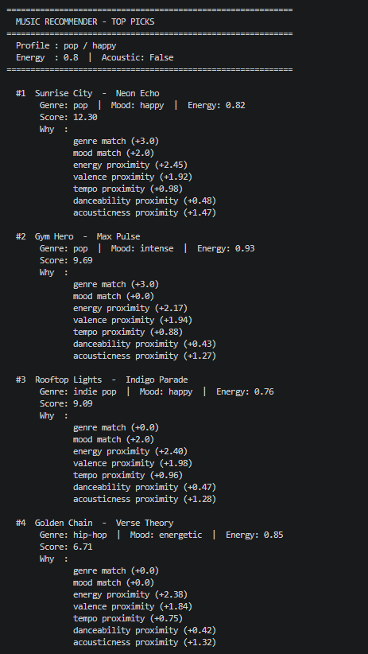
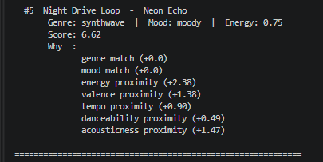

# 🎵 Music Recommender Simulation

## Project Summary

In this project you will build and explain a small music recommender system.

Your goal is to:

- Represent songs and a user "taste profile" as data
- Design a scoring rule that turns that data into recommendations
- Evaluate what your system gets right and wrong
- Reflect on how this mirrors real world AI recommenders

This simulation builds a content-based music recommender that scores songs by how closely their audio attributes match a user's stated preferences. It prioritizes emotional fit (energy and valence) and genre alignment over secondary signals like tempo or danceability. It mirrors the content-based layer used by systems like Spotify, but skips collaborative filtering since that requires data from millions of users.

---

## How The System Works

Real-world recommenders like Spotify and YouTube Music combine two strategies. The first is collaborative filtering, which finds users with similar taste and borrows their listening history. The second is content-based filtering, which analyzes the audio properties of songs directly. This simulation uses content-based filtering only, so it does not need data from other users. It focuses on matching the emotional vibe of a song, defined mainly by energy level and mood. Genre carries the most weight because recommending the wrong genre is always a bad match, no matter how well the other numbers line up. Every recommendation includes a plain-language reason so you can see exactly what drove the score.

### Data Flow



This shows how a single song travels through the system: it is loaded from the CSV, compared against the user profile feature by feature, assigned a score, and then sorted against every other scored song before the top results are returned.

### Song Features

Each `Song` object stores the following attributes:

| Feature | Type | What It Captures |
|---|---|---|
| `id` | int | Unique identifier |
| `title` | str | Song name |
| `artist` | str | Artist name |
| `genre` | str | Broad style category (pop, lofi, rock, jazz, ambient, synthwave, indie pop) |
| `mood` | str | Emotional label (happy, chill, intense, relaxed, focused, moody) |
| `energy` | float (0-1) | How loud, fast, and active the track feels |
| `tempo_bpm` | float | Beats per minute (60 is slow, 150 is fast) |
| `valence` | float (0-1) | Emotional tone, 1.0 is happy, 0.0 is sad or tense |
| `danceability` | float (0-1) | How suitable the track is for dancing |
| `acousticness` | float (0-1) | How acoustic vs. electronic the track sounds |

### UserProfile Features

Each `UserProfile` stores the user's stated preferences:

| Field | Type | Role in Scoring |
|---|---|---|
| `favorite_genre` | str | Matched against `song.genre`, worth 3.0 points on exact match |
| `favorite_mood` | str | Matched against `song.mood`, worth 2.0 points on exact match |
| `target_energy` | float (0-1) | Songs closest to this value score highest |
| `likes_acoustic` | bool | True maps to a target of 0.8, False maps to 0.2, then scored by proximity |

### Finalized Algorithm Recipe

Each song receives a total score by summing weighted contributions from every feature:

```
score = genre_match   x 3.0   (exact string match, all-or-nothing)
      + mood_match    x 2.0   (exact string match, all-or-nothing)
      + energy_prox   x 2.5   (1 - |song.energy - user.target_energy|)
      + valence_prox  x 2.0   (1 - |song.valence - user.valence|)
      + acoustic_prox x 1.5   (1 - |song.acousticness - target|)
      + tempo_prox    x 1.0   (max(0, 1 - |song.bpm - target_bpm| / 100))
      + dance_prox    x 0.5   (1 - |song.danceability - user.pref|)
```

Songs are then sorted highest-to-lowest and the top `k` are returned.

These weights were chosen after testing three schemes on the catalog. Genre +3.0 and mood +2.0 produced the widest separation gap (8.08 points) between a strong match and a weak match, compared to 4.81 for the simpler genre +2.0 / mood +1.0 starting point.

### Potential Biases

**Genre lock-in.** Genre carries 3.0 points and uses an exact string match. A user who likes rock will never see a metal song rank above a mediocre rock song, even if the metal song matches every other feature better. Adjacent genres are invisible to the system.

**Mood rigidity.** Mood also uses exact match. "Chill" and "relaxed" feel similar to most listeners, but the system treats them as completely different. A chill-seeking user scores all relaxed songs as if they had no mood preference at all.

**Over-representation of high-energy songs.** Energy has the highest weight of any numeric feature (2.5). For a user with a high target energy, the system may consistently surface aggressive or intense songs even when a gentler option matches every other feature better.

**Cold-start narrowness.** The profile only stores one genre and one mood. A user who listens to both jazz on weekdays and pop on weekends gets a single static profile that satisfies neither context well.

**Small catalog amplifies all of the above.** With 18 songs, a genre mismatch eliminates most of the catalog immediately. In a real system with millions of tracks, the numeric features would do more differentiation work.


---

## Getting Started

### Setup

1. Create a virtual environment (optional but recommended):

   ```bash
   python -m venv .venv
   source .venv/bin/activate      # Mac or Linux
   .venv\Scripts\activate         # Windows

2. Install dependencies

```bash
pip install -r requirements.txt
```

3. Run the app:

```bash
python -m src.main
```

### Running Tests

Run the starter tests with:

```bash
pytest
```

You can add more tests in `tests/test_recommender.py`.

---

## Experiments You Tried

### Experiment 1: Comparing three weight schemes

To decide on the final weights, three schemes were tested against the same user profile (rock/intense/energy 0.88). The test measured how well each scheme separates a strong match (Storm Runner) from a weak one (Library Rain, lofi/chill).

| Scheme | Storm Runner | Library Rain | Separation gap |
|---|---|---|---|
| Starter: genre +2, mood +1 | 7.10 | 2.29 | 4.81 |
| Current: genre +3, mood +2 | 12.17 | 4.09 | 8.08 |
| Flat: all features equal +1 | 6.79 | 2.83 | 3.96 |

All three schemes put the correct song at rank 1. The difference shows up in the middle of the list.

With the starter scheme (genre +2, mood +1), Iron Verdict (metal/angry) scores 3.60 and ranks 5th. With the current scheme it scores 6.24 and ranks 5th as well, but the absolute gap between it and the lofi songs is wider, which matters more as the catalog grows.

The flat scheme loses the most discrimination because energy, tempo, and acousticness already partially correlate. Giving them the same weight as genre means a wrong-genre song with a lucky energy value can leapfrog a correct-genre song.

**Decision: keep genre at 3.0 and mood at 2.0.** The wider separation makes the ranking more stable when the catalog is large and many songs are numerically close.

### Experiment 2: Default pop/happy profile output




The top result was Sunrise City (score 12.30), which matched on both genre (pop) and mood (happy) for a combined +5.0 before any numeric features were counted. Gym Hero ranked second despite a mood mismatch because a genre match alone is worth 3.0 points. Rooftop Lights ranked third with a mood match but no genre match, confirming that genre outweighs mood in the scoring rule. Results 4 and 5 had no categorical matches and scored on numeric proximity only, dropping more than 2 points below the categorical tier.

### Finalized Algorithm Recipe

```
score = genre_match   x 3.0   <- categorical, strongest signal, eliminates whole categories
      + mood_match    x 2.0   <- categorical, emotional state
      + energy_prox   x 2.5   <- numerical, core vibe signal, proximity scored
      + valence_prox  x 2.0   <- numerical, happy vs. brooding
      + acoustic_prox x 1.5   <- numerical, organic vs. electronic texture
      + tempo_prox    x 1.0   <- numerical, activity context, normalized over 100 BPM
      + dance_prox    x 0.5   <- numerical, least unique, correlated with energy+tempo
```

Where proximity means: `1 - |song_value - user_target|` for 0-1 scaled features,
and `max(0, 1 - |song_bpm - target_bpm| / 100)` for tempo.

**Why genre outweighs mood:** Genre eliminates entire catalog sections. A jazz fan getting a metal recommendation is a total mismatch regardless of energy or mood. Mood is a gradient where adjacent values (chill/relaxed, intense/energetic) can still feel compatible.

**Why energy (2.5) outweighs valence (2.0):** Energy is the single most discriminating numerical feature in this catalog. It spans 0.22 to 0.97 across 18 songs, a wider effective range than valence (0.18 to 0.84).

**Why danceability (0.5) is lowest:** It is the most correlated feature. High energy + fast tempo already implies high danceability in most cases, so it adds little unique information.

---

## Limitations and Risks

Summarize some limitations of your recommender.

Examples:

- It only works on a tiny catalog
- It does not understand lyrics or language
- It might over favor one genre or mood

You will go deeper on this in your model card.

---

## Reflection

Read and complete `model_card.md`:

[**Model Card**](model_card.md)

Write 1 to 2 paragraphs here about what you learned:

- about how recommenders turn data into predictions
- about where bias or unfairness could show up in systems like this


---

## 7. `model_card_template.md`

Combines reflection and model card framing from the Module 3 guidance. :contentReference[oaicite:2]{index=2}  

```markdown
# 🎧 Model Card - Music Recommender Simulation

## 1. Model Name

Give your recommender a name, for example:

> VibeFinder 1.0

---

## 2. Intended Use

- What is this system trying to do
- Who is it for

Example:

> This model suggests 3 to 5 songs from a small catalog based on a user's preferred genre, mood, and energy level. It is for classroom exploration only, not for real users.

---

## 3. How It Works (Short Explanation)

Describe your scoring logic in plain language.

- What features of each song does it consider
- What information about the user does it use
- How does it turn those into a number

Try to avoid code in this section, treat it like an explanation to a non programmer.

---

## 4. Data

Describe your dataset.

- How many songs are in `data/songs.csv`
- Did you add or remove any songs
- What kinds of genres or moods are represented
- Whose taste does this data mostly reflect

---

## 5. Strengths

Where does your recommender work well

You can think about:
- Situations where the top results "felt right"
- Particular user profiles it served well
- Simplicity or transparency benefits

---

## 6. Limitations and Bias

Where does your recommender struggle

Some prompts:
- Does it ignore some genres or moods
- Does it treat all users as if they have the same taste shape
- Is it biased toward high energy or one genre by default
- How could this be unfair if used in a real product

---

## 7. Evaluation

How did you check your system

Examples:
- You tried multiple user profiles and wrote down whether the results matched your expectations
- You compared your simulation to what a real app like Spotify or YouTube tends to recommend
- You wrote tests for your scoring logic

You do not need a numeric metric, but if you used one, explain what it measures.

---

## 8. Future Work

If you had more time, how would you improve this recommender

Examples:

- Add support for multiple users and "group vibe" recommendations
- Balance diversity of songs instead of always picking the closest match
- Use more features, like tempo ranges or lyric themes

---

## 9. Personal Reflection

A few sentences about what you learned:

- What surprised you about how your system behaved
- How did building this change how you think about real music recommenders
- Where do you think human judgment still matters, even if the model seems "smart"

